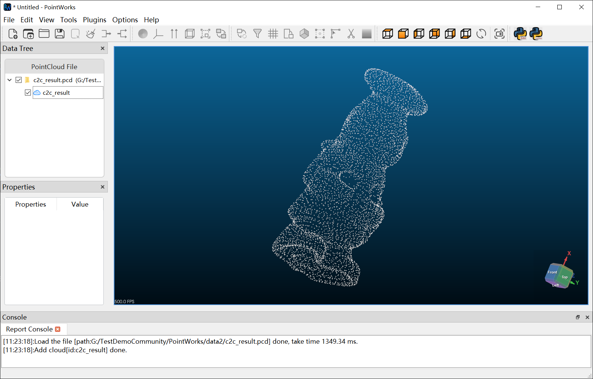

# PointWorks

**专业三维点云处理软件** — 面向测绘、遥感与三维重建领域的一站式点云处理工具。

**[官网](https://libaocheng3811.github.io/PointWorks-docs/)** | **[下载](https://libaocheng3811.github.io/PointWorks-docs/download)** | **[文档](https://libaocheng3811.github.io/PointWorks-docs/docs/intro)** | **[Releases](https://github.com/Libaocheng3811/PointWorks/releases)**



## 功能概览

### 点云可视化

- 三维交互式可视化，支持旋转、平移、缩放
- 多视窗同时显示，独立相机控制
- 点云颜色渲染、法线显示、 scalar field 着色
- 大规模点云 LOD 自适应渲染，流畅处理千万级点云

### 多格式支持

| 格式 | 扩展名 | 读取 | 写入 |
|------|--------|:----:|:----:|
| LAS / LAZ | .las .laz | ✓ | ✓ |
| E57 | .e57 | ✓ | ✓ |
| PLY | .ply | ✓ | ✓ |
| PCD | .pcd | ✓ | ✓ |
| TXT / XYZ | .txt .xyz .asc | ✓ | ✓ |
| OBJ | .obj | ✓ | ✓ |
| STL | .stl | ✓ | ✓ |
| VTK | .vtk | ✓ | ✓ |

### 滤波处理

直通滤波、体素降采样、统计离群点移除、半径离群点移除、条件滤波、网格最小值/最大值滤波等。

### 点云配准

支持 ICP、ICP(with Normals)、GICP、IA-RANSAC、SCPR、NDT 等多种配准算法，提供基于中心点的粗配准和精细配准两步流程。

### 分割

- **地面分割** — CSF 布料模拟滤波
- **植被分割** — 基于 ExG、NGRDI、CIVE、ExG_ExR 四种植被指数，Otsu 自动阈值
- **形状检测、形态学滤波、区域生长、欧式聚类、超体素**

### 变化检测

- 云对云距离 (C2C)
- 云对网格距离 (C2M)
- M3C2 多尺度模型对比距离
- 距离结果以 Jet 色带可视化

### 曲面重建与网格

Poisson 曲面重建、Greedy 投影三角化、凸包计算、边界提取。

### 特征提取

PFH、FPFH、VFH、SHOT、CVFH、ESF 等特征描述符计算。

### 嵌入式 Python

内置 Python 3.9 脚本引擎，提供 100+ API 函数，支持交互式控制台和脚本编辑器，可自动化批量处理任务。

### 其他

- 中英文界面切换
- 文件拖拽导入
- 坐标系变换与缩放
- 包围盒显示与测量
- 法线估计与缩放

## 下载安装

前往 **[下载页面](https://libaocheng3811.github.io/PointWorks-docs/download)** 获取最新版本。

提供两种安装方式：

- **安装程序** — 双击运行，自动安装到系统
- **绿色免安装版** — 解压即用，无需安装

> 系统要求：Windows 10/11 (64-bit)，8 GB+ RAM，支持 OpenGL 3.3+ 的显卡

## 编译构建

### 依赖环境

| 依赖 | 版本 |
|------|------|
| CMake | 3.28+ |
| C++ | C++17 |
| Qt5 | 5.15.2 |
| VTK | 9.1.0 |
| PCL | 1.12.1 |
| Python | 3.9 (EXACT) |
| 编译器 | MSVC 2019+ |

### 构建命令

```bash
cmake -B build -S . -DCMAKE_BUILD_TYPE=Release
cmake --build build --config Release
```

构建完成后，第三方 DLL 会自动复制到输出目录。也可设置环境变量后运行 `scripts/deploy_collect.bat` 收集完整依赖。

### 环境变量

以下路径仅为示例，请替换为你本机的实际安装路径：

```bat
set QT_DIR=<你的Qt安装路径>            :: 例如 D:\Qt\5.15.2\msvc2019_64
set PCL_DIR=<你的PCL根目录>            :: 例如 D:\LibCommunity\PCL 1.12.1
set PYTHON_HOME=<你的Python路径>       :: 可选，例如 D:\Python39
```

## 打包发布

### 1. 构建 + 收集依赖

```bat
cmake --build cmake-build-release-visual-studio --config Release
scripts\deploy_collect.bat
```

### 2. 生成发布包

**绿色免安装版 (ZIP)：**

```bat
scripts\deploy_portable.bat
```

**安装程序 (Inno Setup)：**

```bat
"C:\Program Files (x86)\Inno Setup 6\ISCC.exe" installer\pointworks.iss
```

### 3. 发布

将生成的安装包上传到 [GitHub Releases](https://github.com/Libaocheng3811/PointWorks/releases)，创建新 tag 并发布即可。

## 许可证

本项目使用的第三方库请遵循各自的许可证协议。
